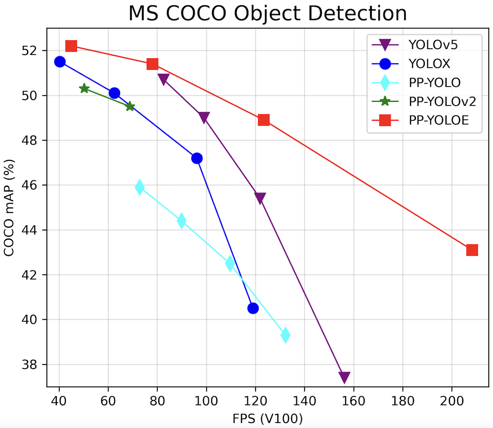

## Introduction

**PPYOLOE**是百度提出的单阶段**Anchor-free**模型，超越了多种**YOLO**模型，本仓库实现**PPYOLOE端到端的Tensorrt部署**。

<div align="center">

</div>

## Environment

- Tensorrt 8.4.1.5
- Cuda 10.2 Cudnn 8.4.1
- onnx 1.8.0
- onnx-simplifier 0.3.10
- onnx-graphsurgeon 0.3.19
- Torch 1.10.0

## Benchmark

|   Model   | Size | mAP<sup>val</sup> 0.5:0.95 | GTX1650 FP16(ms) |                     ONNX (EfficientNMS)                      |
| :-------: | :--: | :------------------------: | :--------------: | :----------------------------------------------------------: |
| PPYOLOE-S | 640  |            43.0            |        13        | [model](https://github.com/Monday-Leo/PPYOLOE_Tensorrt/releases/download/v1.0/ppyoloes_nms.onnx) |
| PPYOLOE-M | 640  |            49.0            |        20        | [model](https://github.com/Monday-Leo/PPYOLOE_Tensorrt/releases/download/v1.0/ppyoloem_nms.onnx) |
| PPYOLOE-L | 640  |            51.4            |        30        | [model](https://github.com/Monday-Leo/PPYOLOE_Tensorrt/releases/download/v1.0/ppyoloel_nms.onnx) |
| PPYOLOE-X | 640  |            52.3            |        52        | [model](https://github.com/Monday-Leo/PPYOLOE_Tensorrt/releases/download/v1.0/ppyoloex_nms.onnx) |

说明：此处FP16预测时间包含**preprocess+inference+nms**，与官方测速不同；mAP<sup>val</sup>为原始Paddle模型精度，转换后精度未测试。

## Quick Start

下载PaddleDetection仓库，安装相关依赖，并导出训练模型。因为**初始NMS中部分算子不支持Tensorrt**，需要转换，所以导出时设置`exclude_nms=True`，**去除NMS**。

```
git clone https://github.com/PaddlePaddle/PaddleDetection.git
cd PaddleDetection
```

```
python3 tools/export_model.py \
  -c configs/ppyoloe/ppyoloe_crn_s_300e_coco.yml \
  -o weights=https://paddledet.bj.bcebos.com/models/ppyoloe_crn_s_300e_coco.pdparams \
  trt=True \
  exclude_nms=True \
  TestReader.inputs_def.image_shape=[3,640,640] \
  --output_dir inference_model
```

安装paddle2onnx，并通过下方命令**导出onnx模型**。

```
paddle2onnx --model_dir inference_model/ppyoloe_crn_s_300e_coco \
            --model_filename model.pdmodel \
            --params_filename model.pdiparams \
            --save_file examples/ppyoloe_crn_s_300e_coco.onnx \
            --input_shape_dict "{'image':[1, 3, 640, 640], 'scale_factor': [1, 2]}"
```

使用本仓库中EfficientNMS_TRT.py，为onnx模型**添加EfficientNMS算子**,注意**修改文件头部常量**。

```
INPUT_PATH = './onnx_model/ppyoloe_crn_s_300e_coco.onnx'
WEIGHTS_TYPE = "s"
SAVE_PATH = "./onnx_model/ppyoloes_nms.onnx"
CLASS_NUM = 80
SCORE_THRESHOLD = 0.5
IOU_THRESHOLD = 0.4
```

```
python EfficientNMS_TRT.py
```

使用**Tensorrt官方工具trtexec**转化添加完EfficientNMS的onnx模型。**FP32预测删除`--fp16`参数即可**。

```
trtexec --onnx=./ppyoloes_nms.onnx --saveEngine=./ppyoloes_nms_fp16.engine --fp16 --workspace=30
```

等待生成序列化模型后，修改本仓库**infer.py模型路径和图片路径**。

```
trt_engine = TRT_engine("./trt_model/ppyoloes_nms_fp16.engine")
img1 = cv2.imread("./pictures/zidane.jpg")
```

```
python infer.py
```

<div align="center">

</div>

## Reference

https://github.com/PaddlePaddle/PaddleDetection

https://github.com/ultralytics/yolov5

https://github.com/Linaom1214/tensorrt-python

https://github.com/triple-Mu
